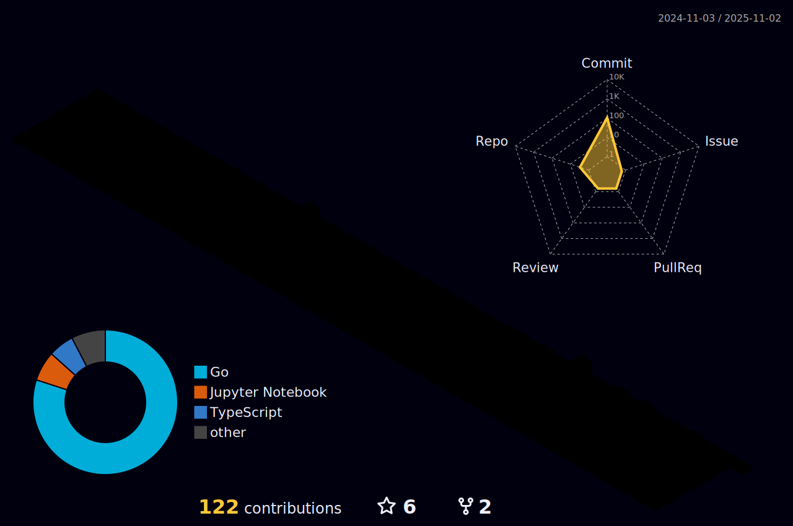

<h3 align="center">Hello! I'm Pluz</h3>
<h3 align="center" >I'm Learning Machine Learning  </h3>

<h1 align="center" >Github Stats:chart_with_upwards_trend:</h1>

<h1 align="center">Holo Pins</h1>

<h1 align="center">42 Bangkok</h1>

<h1 align="center">&#129497;Kaggle</h1>

<?xml version="1.0" ?><!DOCTYPE svg  PUBLIC '-//W3C//DTD SVG 1.1//EN'  'http://www.w3.org/Graphics/SVG/1.1/DTD/svg11.dtd'><svg height="512px" style="enable-background:new 0 0 512 512;" version="1.1" viewBox="0 0 512 512" width="512px" xml:space="preserve" xmlns="http://www.w3.org/2000/svg" xmlns:xlink="http://www.w3.org/1999/xlink"><g id="_x31_89-kaggle"><g><path d="M385.708,476.478L254.742,313.713l125.578-121.534c2.334-2.426,1.526-9.433-4.761-9.433h-62.16    c-3.145,0-6.288,1.618-9.433,4.761L185.128,307.604V32.738c0-4.491-2.247-6.737-6.738-6.737h-46.618    c-4.492,0-6.737,2.246-6.737,6.737v446.433c0,4.491,2.246,6.738,6.737,6.738h46.618c4.491,0,6.738-2.247,6.738-6.738v-97.91    l27.666-26.317l99.257,126.294c2.695,3.145,5.839,4.762,9.432,4.762h60.095c3.143,0,4.939-0.899,5.389-2.696L385.708,476.478z" style="fill:#20BEFF;"/></g></g><g id="Layer_1"/></svg>

